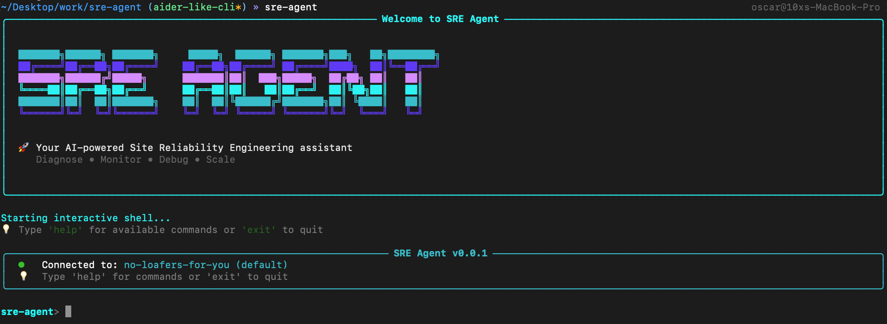
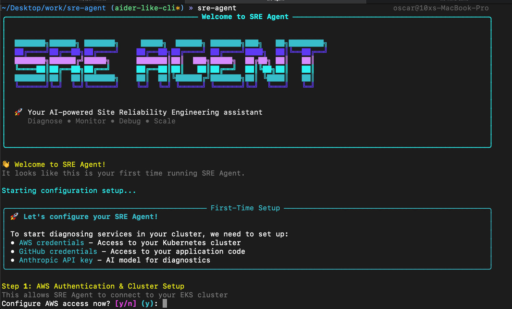
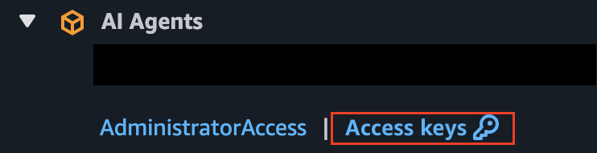
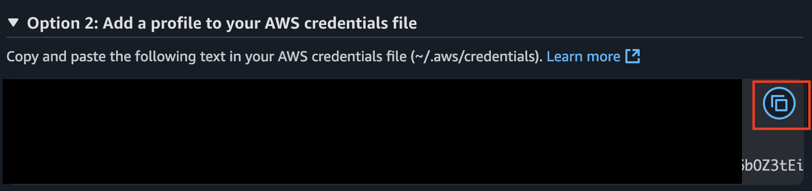
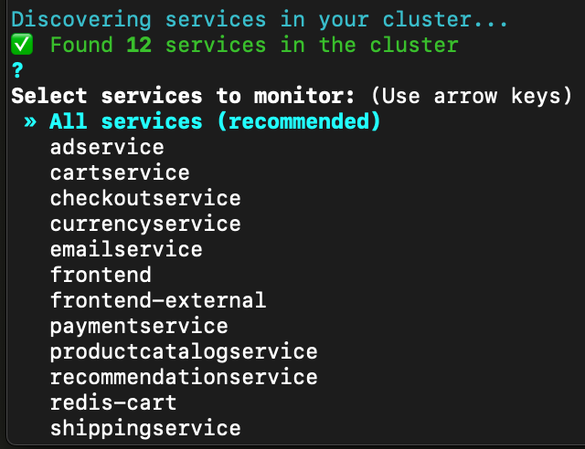
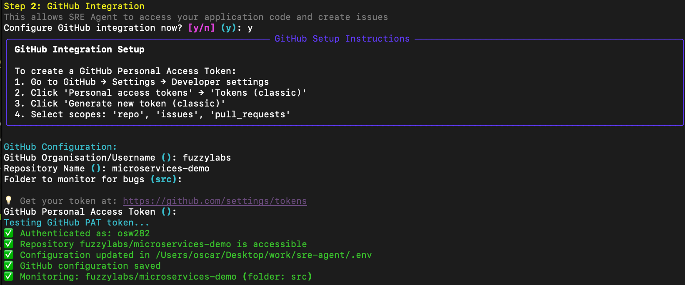
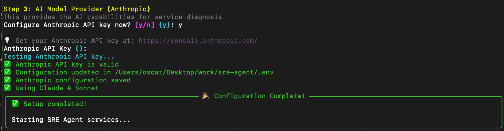
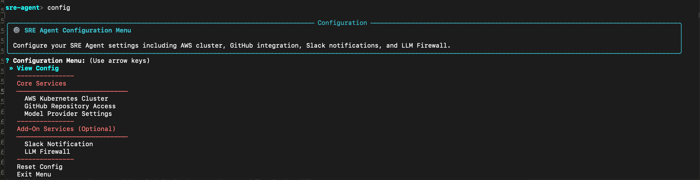

<h1 align="center">
    🚀 Site Reliability Engineer (SRE) Agent :detective:
</h1>

Welcome to the **SRE Agent** project! This open-source AI agent helps you debug, keep your systems on Kubernetes healthy, and make your DevOps life easier.

Now powered by a **command-line interface (CLI)**, you can interact directly with the agent from your terminal. Plug in your Kubernetes cluster, GitHub repo, and let the agent handle the heavy lifting, diagnosing, reporting, and keeping your team in the loop.

## 🌟 What is SRE Agent?

SRE Agent is your AI-powered teammate for monitoring application and infrastructure logs, diagnosing issues, and reporting diagnostics after errors. With the new CLI, it’s easier than ever to connect the agent into your stack and start focusing on building instead of firefighting.



## 🤔 Why Did We Build This?

We wanted to learn best practices, costs, security, and performance tips for AI agents in production. Our journey is open-source, check out our [Production Journey Page](/docs/production-journey.md) and [Agent Architecture Page](/docs/agent-architecture.md) for the full story.

We've been writing blogs and sharing our learnings along the way. Check out our [blog](https://www.fuzzylabs.ai/blog) for insights and updates.

> **Contributions welcome!** [Join us](CONTRIBUTING.md) and help shape the future of AI-powered SRE.

## ✨ Features

- 🕵️‍♂️ **Root Cause Debugging** – Finds the real reason behind app and system errors
- 📜 **Kubernetes Logs** – Queries your cluster for logs and info
- 🔍 **GitHub Search** – Digs through your codebase for bugs
- 🚦 **CLI Powered** – Interact with the agent directly from your terminal, with guided setup and zero manual image building required. Run diagnostics, manage integrations, and get insights without leaving the CLI.

> Powered by the [Model Context Protocol (MCP)](https://github.com/modelcontextprotocol) for seamless LLM-to-tool connectivity.

## 🤖 Supported LLM Providers

The SRE Agent currently supports:

### Anthropic
- **Models**: e.g. "claude-4-0-sonnet-latest"
- **Setup**: Requires `ANTHROPIC_API_KEY`


## 🛠️ Prerequisites

- Python 3.12 or higher
- An app deployed on AWS EKS (Elastic Kubernetes Service)
- Anthropic API key

## ⚡ Quick Start (5 minutes)

### 1️⃣ Install the SRE Agent CLI
```bash
pip install sre-agent
```

### 2️⃣ Start the agent
```bash
sre-agent
```

This is what you’ll see when the agent starts up for the first time.



### 3️⃣ Follow the guided setup to finish configuring the agent

#### Step 1️⃣: AWS

The first step is setting up your AWS credentials so the agent can access the cluster where your app is deployed.


From your AWS portal, click **Access keys**:



Copy the credentials shown under **Option 2** and paste them into the CLI.

⚠️ Note: After pasting your credentials, you’ll need to press **Enter twice** to confirm.



Next, provide your **cluster name**. This should be the cluster where your app is deployed and where you want to monitor your deployments.

Once entered, the agent will automatically test the connection to the cluster using the credentials you provided.

Select the specific services you want to monitor by using a list such as [2,6,7] or all of them if you would like,



#### Step 2️⃣: GitHub Integration

We will need to configure github access with a pat token so that the agent can read your repository and look at the code to find out what's causing the error.

Follow the guided step, this should be straight forward:



### 3️⃣ Follow the guided setup to finish configuring the agent

#### Step 1️⃣: AWS Setup

Start by configuring your AWS credentials so the agent can access the cluster where your app is deployed.


From your AWS portal, click **Access keys**:


Copy the credentials shown under **Option 2** and paste them into the CLI.

⚠️ Note: After pasting your credentials, press **Enter twice** to confirm.


Next, enter your **cluster name**. This should be the cluster where your app is deployed and where you want to monitor your deployments.

The agent will then test the connection to the cluster using the credentials you provided.

After that, select the specific services you want to monitor. You can choose by index (for example, `[2,6,7]`) or select all of them.


---

#### Step 2️⃣: GitHub Integration

Next, configure GitHub access using a Personal Access Token (PAT). This allows the agent to read your repository and inspect the code when diagnosing issues.

Follow the guided step in the CLI—it’s straightforward:


---

#### Step 3️⃣: Anthropic API Key

Finally, provide your **Anthropic API key**, which will be used as the model provider powering the agent.



### 4️⃣ Start diagnosing issues

You’re now inside the `sre-agent` CLI and ready to run diagnostics.

For example, if your cluster has a service named `currencyservice`, you can run:

```bash
diagnose currencyservice
```


When the diagnosing is completed, you should see the result inside the cli.

To exit the agent, just run the `exit` command.

## ⚙️ Configuration & Add-Ons

You can use the `config` command to set up options such as the cluster name, GitHub settings, and model providers. It also lets you enable additional add-ons, like sending diagnostic results to Slack or activating the Llama Firewall.



## 🔧 For Developers

<details>
<summary>📦 Development Workflow</summary>

### Project Structure
This is a uv workspace with multiple Python services and TypeScript MCP servers:
- `sre_agent/client/`: FastAPI orchestrator (Python)
- `sre_agent/llm/`: LLM service with multi-provider support (Python)
- `sre_agent/firewall/`: Llama Prompt Guard security layer (Python)
- `sre_agent/servers/mcp-server-kubernetes/`: Kubernetes operations (TypeScript)
- `sre_agent/servers/github/`: GitHub API integration (TypeScript)
- `sre_agent/servers/slack/`: Slack notifications (TypeScript)
- `sre_agent/servers/prompt_server/`: Structured prompts (Python)
- `sre_agent/cli/`: The Python CLI that powers the agent (Python)

### Development Commands
```bash
make project-setup    # Install uv, create venv, install pre-commit hooks
make check            # Run linting, pre-commit hooks, and lock file check
make tests            # Run pytest with coverage
make license-check    # Verify dependency licenses
```

### TypeScript MCP Servers
```bash
# Kubernetes MCP server
cd sre_agent/servers/mcp-server-kubernetes
npm run build && npm run test

# GitHub/Slack MCP servers
cd sre_agent/servers/github  # or /slack
npm run build && npm run watch
```

### The CLI

At a high level, there are two main parts you can work on:
- The **CLI**, which you can think of as the “front end.”
- The **agents/MCP servers**, which run in the background.

If you want to work on the CLI, you can install and run it locally with:

```bash
source .venv/bin/activate && pip install -e .
```

### Agents/MCP Servers

If you’re working on the MCP servers, you’ll need to rebuild the Docker images for any server you modify.

We provide two Compose files:

- [compose.agent.yaml](compose.agent.yaml): uses images hosted on GHCR

- [compose.dev.yaml](compose.dev.yaml): uses images built locally on your machine

To test local changes, start the sre-agent with the --dev flag:

```bash
sre-agent --dev
```

This will start the agent using the [compose.dev.yaml](compose.dev.yaml) file.

</details>

## 📚 Documentation

Find all the docs you need in the [docs](docs) folder:

- [Creating an IAM Role](docs/creating-an-iam-role.md)
- [ECR Setup Steps](docs/ecr-setup.md)
- [Agent Architecture](docs/agent-architecture.md)
- [Production Journey](docs/production-journey.md)

## 🙏 Acknowledgements & Attribution

Big thanks to:

- [Suyog Sonwalkar](https://github.com/Flux159) for the [Kubernetes MCP server](/sre_agent/servers/mcp-server-kubernetes/)
- [Anthropic's Model Context Protocol team](https://github.com/modelcontextprotocol) for the [Slack](/sre_agent/servers/slack/) and [GitHub](/sre_agent/servers/github/) MCP servers

## :book: Blogs

Check out our blog posts for insights and updates:

- [Bringing Agentic AI into the Real World](https://www.fuzzylabs.ai/blog-post/bringing-agentic-ai-into-the-real-world)
- [How We're Building an Autonomous SRE with FastMCP](https://www.fuzzylabs.ai/blog-post/how-were-building-an-autonomous-sre-with-fastmcp)
