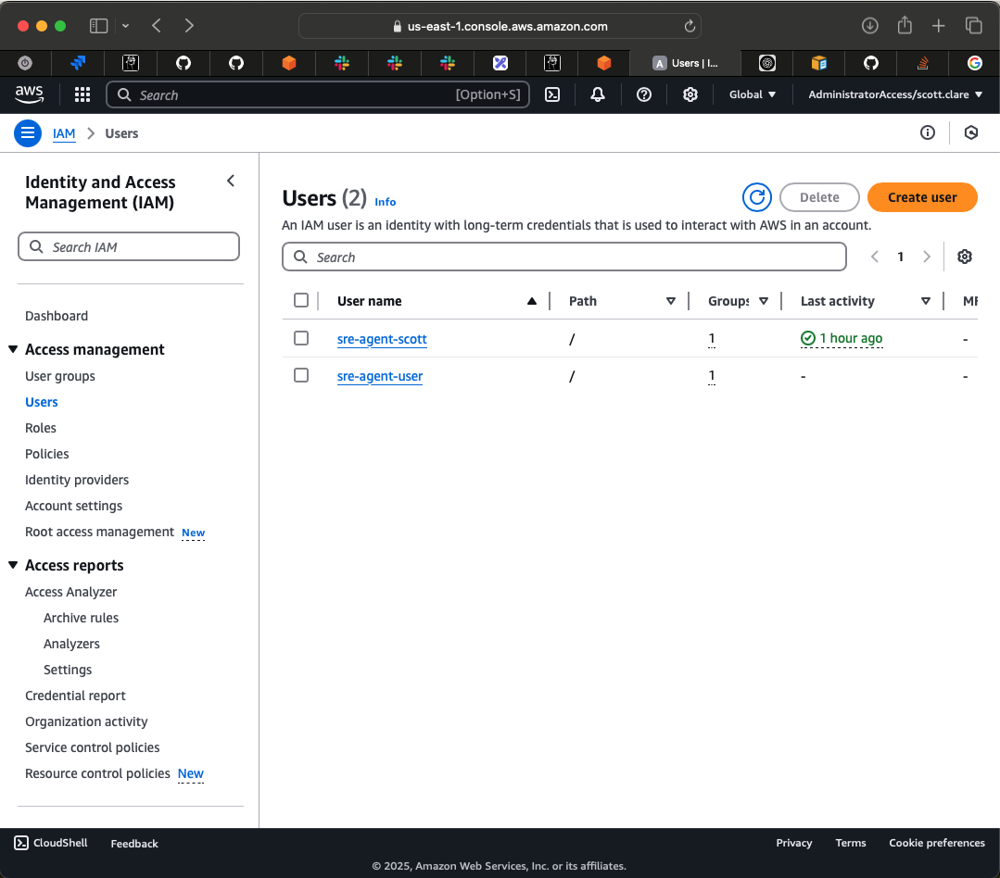
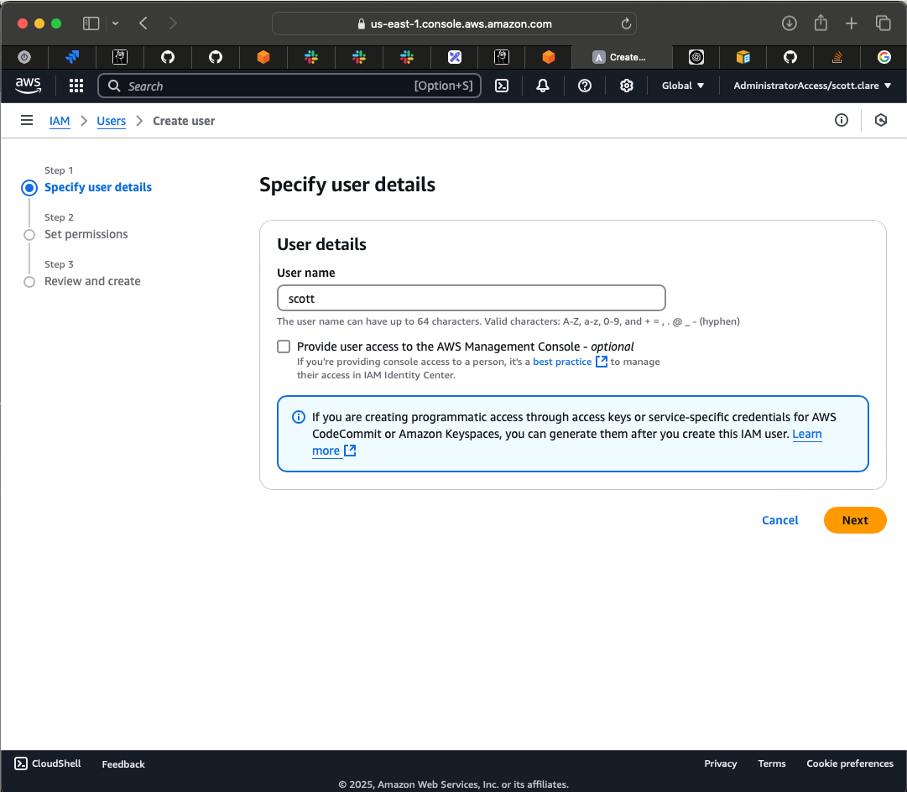
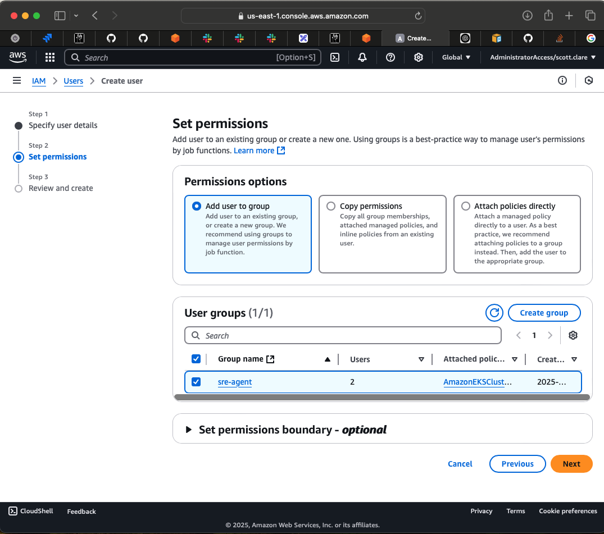
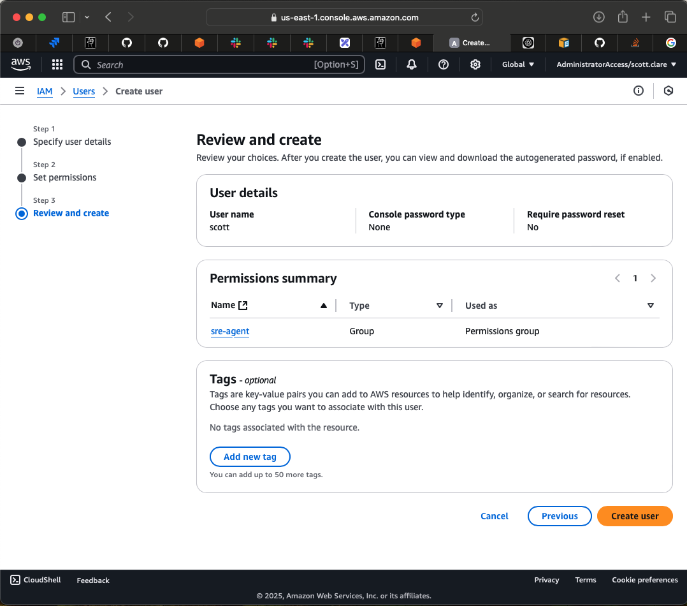
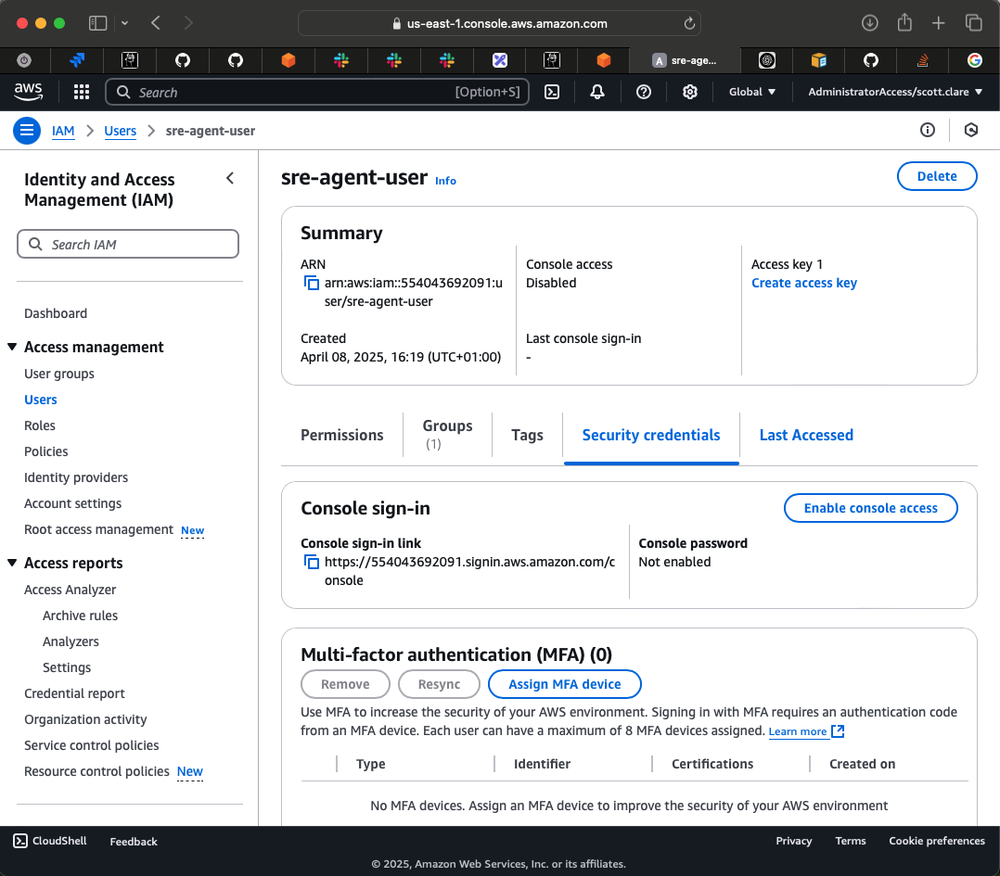
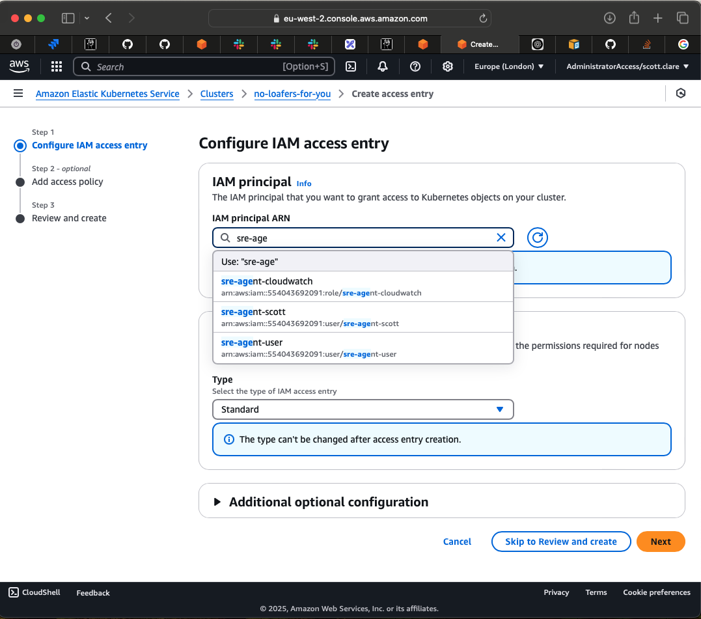
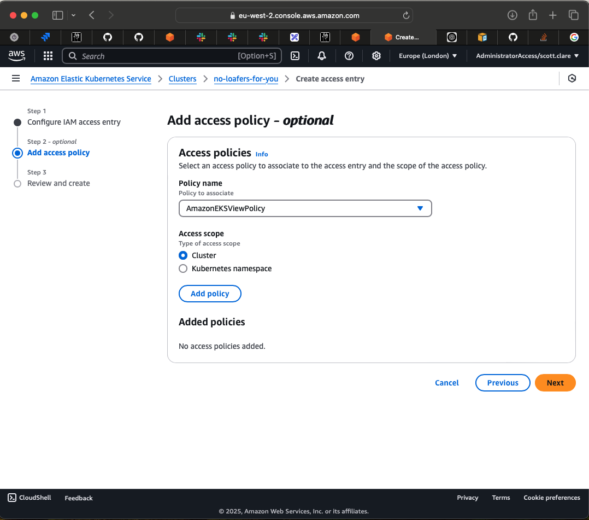

# Creating an IAM User.

When interacting with AWS services, it is important to create an IAM user with the necessary permissions. This user will be used by the SRE agent to interact with AWS services.

There already exists an IAM user group called `sre-agent` that contains the necessary permissions for the SRE agent.

To create a new IAM user with the necessary permissions, follow these steps:

1. Visit the [IAM Users dashboard](https://us-east-1.console.aws.amazon.com/iam/home?region=eu-west-2#/users)

2. Click on the `Create user` button.

3. Enter a user name for the new user.

4. Add the user to the `sre-agent` group.

5. Confirm the creation of the user.

6. Create an access key for the new user.

7. (Additional) Give the user access to the Kubernetes cluster.
  a. Under the cluster that you want to give access in the [EKS dashboard](https://eu-west-2.console.aws.amazon.com/eks/clusters?region=eu-west-2) select the Access tab.
  
  b. Select `Create access entry`.
  c. Select the user you just created.
  
  d. Select the policy you want to give the user access to, we only need `AmazonEKSViewPolicy` for our purposes.
  
